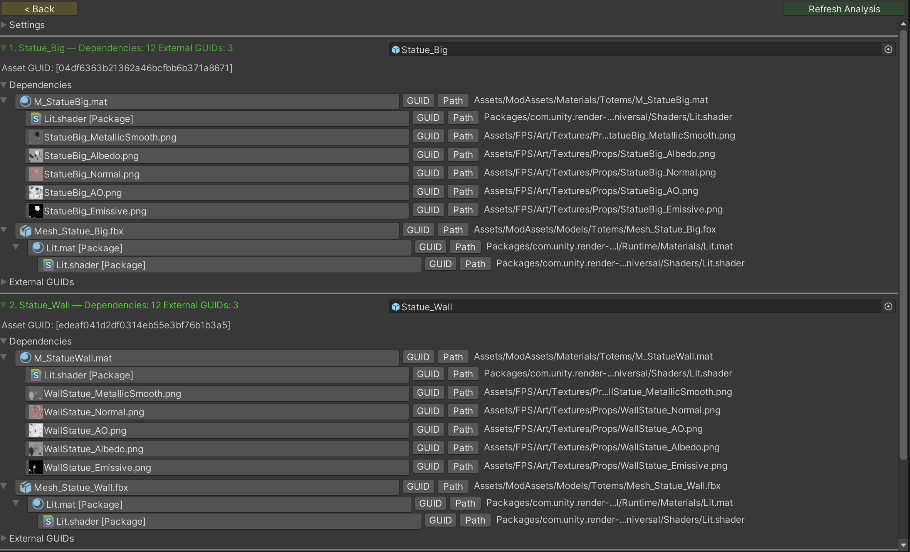
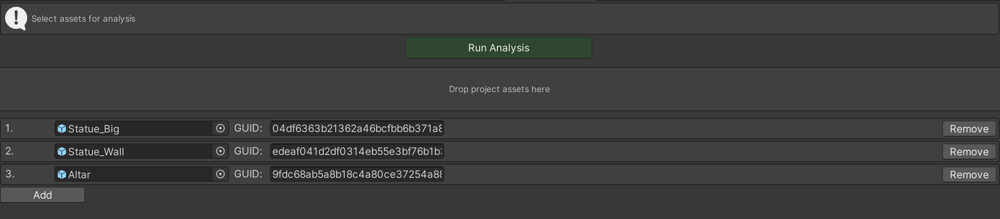

# Asset Inspector 


[](https://opensource.org/licenses/MIT)
[](https://GitHub.com/Naereen/StrapDown.js/graphs/commit-activity)

##
Editor window for inspecting **Unity asset references**: it shows how each scanned asset hangs together in the project (serialized dependencies plus raw `guid:` usages), with optional Addressables / bundle context.

All logic ships in **[AssetInspector.cs](./AssetInspector.cs)** so you can copy this file into `/Editor/` folder.

---

# How it works

**Dependencies (tree)**

For the asset you analyze, the tool walks **direct** links using Unity’s importer graph:

```
AssetDatabase.GetDependencies(assetPath, false)
```

Then it repeats per dependency (excluding the node itself), keeping an **ancestor set** so cycles do not recurse forever. Results are drawn as an **indented tree** so you can see *which dependency pulled in another*.

**External GUID lines**

Separately it scans **lines of the serialized asset** that contain `guid:` patterns, and lists each occurrence with ±2 lines of context.

**Bundles / Addressables**

- **Explicit Addressables** groups are resolved via lightweight reflection against Addressables settings (when installed).
- Optionally you can load an **Addressables BuildLayout** text export for extra bundle names on rows (see the window’s settings foldout).

---

| Results View                           | Selecting Assets                         |
|----------------------------------------|------------------------------------------|
|  |  |

---

| Functionality          | What you get | Purpose                                                                                                                        |
|------------------------|----------------|--------------------------------------------------------------------------------------------------------------------------------|
| **Dependency tree**    | Nested list of everything the asset **pulls in** through `GetDependencies` | Refactor or delete an asset without surprises; see whether a texture is only used “under” a material, cross-bundle usage, etc. |
| **External GUID rows** | Lines in the file that reference other assets by GUID (with context) | Track down stringly references, odd scenes, or assets that do not show up as normal dependency edges.                          |

- **Exclude .cs / filter fields** narrow the **visible** dependency list (and exports); they do not change the underlying dependency graph Unity reports.

# Ways to launch

## From the Project window (selection-aware)

Select one or more assets, then choose:

**Assets → Inspect Asset and Dependencies**

## From the menu (idle launcher)

**Tools → Inspect Assets and GUIDs**

Opens the same window on the **target picker** screen: assign objects by Reference field or paste a GUID then click **Run Analysis**.

---

## Installation

1. Using Unity's Package Manager via https://github.com/AlexeyPerov/Unity-Asset-Inspector.git
2. You can also just copy and paste file **[AssetInspector.cs](./AssetInspector.cs)** inside Editor folder

---

## Contributions

Feel free to report bugs, request new features
or to contribute to this project!

---

## Other tools

##### Dependencies Hunter

- To find unreferenced assets in Unity project see [Dependencies-Hunter](https://github.com/AlexeyPerov/Unity-Dependencies-Hunter).

##### Addressables Inspector

- To analyze addressables layout [Addressables-Inspector](https://github.com/AlexeyPerov/Unity-Addressables-Inspector).

##### Missing References Hunter

- To find missing or empty references in your assets see [Missing-References-Hunter](https://github.com/AlexeyPerov/Unity-MissingReferences-Hunter).

##### Textures Hunter

- To analyze your textures and atlases see [Textures-Hunter](https://github.com/AlexeyPerov/Unity-Textures-Hunter).

##### Materials Hunter

- To analyze your materials and renderers see [Materials-Hunter](https://github.com/AlexeyPerov/Unity-Materials-Hunter).

##### Editor Coroutines

- Unity Editor Coroutines alternative version [Lite-Editor-Coroutines](https://github.com/AlexeyPerov/Unity-Lite-Editor-Coroutines).
- Simplified and compact version [Pocket-Editor-Coroutines](https://github.com/AlexeyPerov/Unity-Pocket-Editor-Coroutines).

